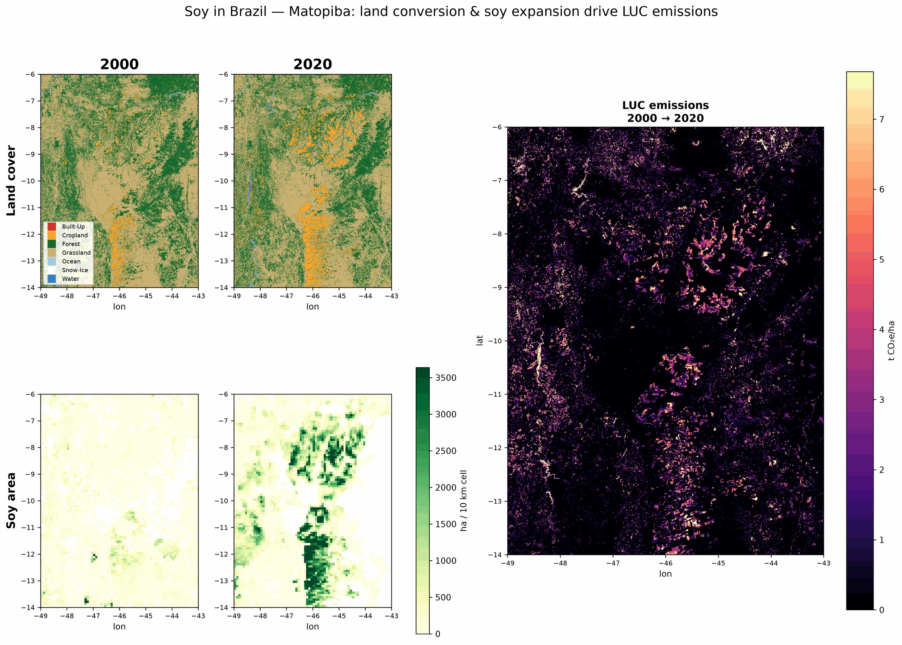

# Cornerstone jdLUC

This repo contains an experimental methodology and data pipeline for estimating the land use change (LUC) related emissions associated with agricultural commodities. This methodology allocates LUC emissions to crops in proportion to their displacement of natural ecosystems, based on high-resolution satellite imagery. It's primarily intended for use in corporate GHG inventories, and follows the new GHGP Land Sector and Removals Standard. It supports two attribution methodologies over a shared per-pixel emissions core: the high-resolution "jurisdictional direct land use change" (jdLUC) calculation where detailed crop maps exist, and a coarser-resolution statistical approach for regions where they don't.

As a proof of concept, the jurisdictional-direct leg focuses on the main row crops grown in the United States (corn, soy, and wheat). Although U.S. land use change emissions are relatively modest contributors to global totals, the U.S. agricultural sector is well studied and has strong data infrastructure, which makes it a good place to start testing methods. The statistical leg extends the same per-pixel emissions core to global crop coverage, using coarser sub-national statistics (IFPRI MapSPAM) where high-resolution crop maps aren't available.

> **Assessing LSRS conformance?** The [executive summary](docs/executive_summary.md) gives a
> concise account of how this methodology maps to the GHGP Land Sector and Removals Standard —
> which requirements it meets, the key modeling choices behind them, and where it deviates or
> remains a work in progress.



*A worked example of the methodology on real data: soy-driven land conversion and the resulting land-use-change emissions in Matopiba, Brazil. For clarity the maps show only the 2000 and 2020 endpoints, but the pipeline uses all five GLAD epochs (2000, 2005, 2010, 2015, 2020). See [`docs/methodology.md`](docs/methodology.md) for the full walkthrough.*

## Why are we publishing this?

Land use change emissions are one of the key targets for scaled global emissions reductions over the next five years. But measurement of LUC emissions is much harder and more uncertain than energy sector emissions, requiring sophisticated analysis of remote sensing imagery and complex modeling of carbon stocks and flows.

Although there are a number of LUC datasets already available for corporate GHG inventories, the emissions factors they publish differ by factors of 5x or more, thanks to differing choices at various points in the complex LUC modeling chain. Some of the LUC methodologies are very well documented, others less so. But even with the best methodology papers, it's extremely challenging to trace the origin of emissions factor differences to specific methodology decisions, or to see which choices are causing the biggest swings.

Therefore, we've come to believe the best way for the corporate measurement ecosystem to get to credible and stable LUC numbers is to shift to open-source LUC models, at least for the base data cleaning, harmonization, and math. Runnable code is the clearest documentation and the strongest platform for collaboration.

The methodology and technical decisions in this repo are intended as a starting point for discussion and collaboration. The LUC space is early. But we thought the best way to get a good conversation going was to actually publish a working open-source implementation.

## Data access

The pipeline publishes three artifacts — see `docs/data.md` for each artifact's full schema, grid, and variable/column reference.

Harmonized inputs and per-pixel emissions (zarr):

```python
>>> import xarray
>>> harmonized = xarray.open_zarr("gs://cornerstone-luc/v3-jdluc-sluc-south-america/harmonize.zarr", consolidated=False)
>>> emissions = xarray.open_zarr("gs://cornerstone-luc/v3-jdluc-sluc-south-america/emit.zarr", consolidated=False)
```

Emissions factors (parquet):

```python
>>> import pandas
>>> emission_factors = pandas.read_parquet("gs://cornerstone-luc/v3-jdluc-sluc-south-america/emissions-factors.parquet")
```

The data is licensed [CC-BY 4.0](https://creativecommons.org/licenses/by/4.0/). Please follow the latest attribution guidance in ATTRIBUTION.md.

## Methodology and architecture

Once you're ready to look under the hood:

- `docs/executive_summary.md` — the short, non-technical overview: what jdLUC is, why LUC
  emissions matter, and the headline takeaways. Start here if you're new.
- `docs/methodology.md` — the high-level overview of the methodology: the datasets behind
  it, how we quantify per-pixel emissions, and how the jurisdictional-direct and statistical
  attribution legs produce emissions factors. The *what* we compute and *why*, from a
  scientific standpoint.
- `docs/architecture.md` — the system architecture and the rationale behind it: why we
  build on the [Pangeo](https://pangeo.io/) stack, how the five-stage pipeline is
  structured, and the tooling, storage, and caching choices that make it reproducible on a
  single host. The *how* it's built and *why those choices*.
- `docs/data.md` — the published data products: storage locations, grids, and full schemas
  for the harmonized inputs, per-pixel emissions, and emissions-factor table.
- `docs/coverage.md` — the full list of countries and territories the pipeline produces
  emissions factors for, by ISO 3166-1 alpha-3 code.

## Running and contributing

### Getting set up

You'll need [uv](https://docs.astral.sh/uv/getting-started/installation/) installed as the Python env manager, plus a GCP project with GCS access.

```bash
# Copy the example env file and fill in your values.
cp .env.example .env
# Fill in the values in .env, including for USDA QuickStats and Harvard Dataverse

# Sync Python dependencies into the project venv.
uv sync

# Authenticate gcloud application-default credentials (for GCS access).
gcloud auth application-default login --project "${GCP_PROJECT}"
```

### Running the pipeline

The pipeline runs as a sequence of per-stage entry points. Stages 1–3 operate on a **continent** (`AFRICA`, `ASIA`, `EUROPE`, `NORTH_AMERICA`, `OCEANIA`, `RUSSIA`, `SOUTH_AMERICA`, `UNCLASSIFIED`); stages 4–5 operate on one or more **ISO 3166 country codes** plus a `--methodology-name` (`STATISTICAL` or `JURISDICTIONAL_DIRECT`). The example below reproduces the United States via the statistical leg:

```bash
# 1. Ingest each source dataset for the continent (positional: continent, dataset).
#    Repeat per DATASET in the inventory (see docs/methodology.md).
uv run python -m jdluc.ingest NORTH_AMERICA GLAD_GLCLUC

# 2. Harmonize the continent's tiles onto the common grid (--grid-name defaults to GLAD ~30 m).
uv run python jdluc/harmonize.py NORTH_AMERICA

# 3. Compute per-pixel land-conversion emissions (writes zarr).
uv run python jdluc/emit.py NORTH_AMERICA

# 4. Attribute emissions to crops for one or more countries (writes the rollup parquet).
uv run python jdluc/attribute.py USA --methodology-name STATISTICAL

# 5. Reduce the rollup to the emissions-factor table (writes parquet).
uv run python jdluc/trace.py USA --methodology-name STATISTICAL
```

Each stage pulls its cached upstreams, so re-running a later stage recomputes only what's missing. The artifacts these stages write are documented in `docs/data.md`.

### Running tests

```bash
uv run pytest jdluc
```

### Linting the codebase

```bash
uv run pre-commit run
```

### Contributing

The repo is maintained by the Cornerstone Sustainability Data Initiative team. We welcome contributions via pull requests. For more open-ended discussion, feel free to open an issue.
